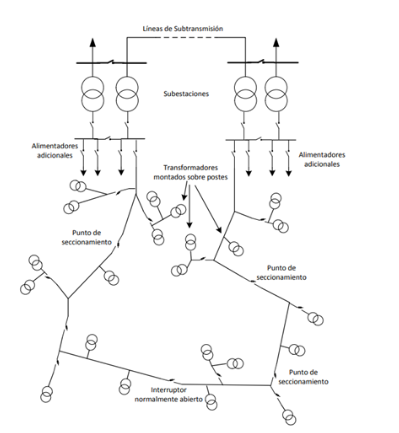

# Introducción
Para Enel Colombia la calidad de servicio es un tema de vital importancia, de tal manera que se encuentra declarada en su Política Integrada de Salud & Seguridad Laboral, Medio Ambiente, Calidad y Energía y hace énfasis en su eje estratégico organizacional denominado Competitividad, “entendida en términos de Excelencia Operacional, traducida en excelencia en la calidad y la atención al cliente, excelencia técnica en todas las actividades y funciones que adelantan (disponibilidad, calidad del servicio y control de pérdidas), logrando operar de forma óptima el negocio para convertirse en líderes frente a sus competidores” . De esta manera para Enel Colombia es importante mantener la continuidad del servicio y disminuir la tasa de fallas y la duración de estas. 

 
El presente trabajo aborda el desarrollo de un modelo para establecer las acciones que requiere el operador de red Enel Colombia en su sistema de distribución, minimizando los indicadores de continuidad del suministro eléctrico mediante mantenimientos correctivos, trabajos de inversión o reconfiguraciones de la topología del circuito. La determinación de los circuitos a incluir en el plan de mantenimiento y los trabajos a realizar es crucial para la optimización ya que siempre se busca mejora en la confiabilidad del sistema; lo que se pretende es analizar la información de la composición eléctrica  del circuito, causas de falla e indicadores de calidad para luego presentar una metodología y la elaboración de un modelo que clasifique los circuitos eléctricos de media tensión en las diferentes actividades que se deban realizar y poder finalmente exponer recomendaciones al operador de red, de las ventajas y/o desventajas de implementar el modelo propuesto. 

# Descripción de un sistema de distribución

Se entiende por sistema de distribución de energía eléctrica a la disposición adoptada por los elementos del sistema tales cómo conductores, transformadores y protecciones, con el fin de lograr que la energía generada por las centrales eléctricas y transportada a través del sistema de transmisión o inmersa en el sistema de distribución, pueda ser utilizada en los sitios de consumo, o sea la carga (residencial, comercial e industrial). Los transformadores de distribución están conectados por el primario al sistema de Media Tensión y por el secundario a la red de Baja Tensión, llevando la potencia a niveles de utilización para los usuarios conectados. 

# Estructura del repositorio

├── LICENSE  
├── README.md          <- README para los desarrolladores.  
├── data  
│   ├── external       <- Datos desde teceras partes.  
│   ├── interim        <- Data intermedia que ha sido transformada  
│   ├── processed      <- Data canonical final lista para los modelos  
│   └── raw            <- Original e inmutable data.  
├── docs               <- documentación creada.  
├── models             <- Resumen de modelos.  
├── reports            <- Analisi generados como HTML, PDF, LaTeX, etc.  
│   └── figures        <- Figures generadas para sr usadas en reporting.  
│
├── requirements.txt   <- Archivo de requierementos para crear el ambientb de desarollo con `pip freeze > │                        requirements.txt`  
│
├── src                <- Codigo fuente para este proyecto.  
│   └── notebooks  <- notebooks de jupyter  
│

# Análisis Exploratorio de Datos
Una preliminar analisis exploratorio de datos puede ser encontrado en:
(https://github.com/EduardoToledoMIAD/distribucion_potencia/blob/main/src/notebooks/1_0_et_exploracion_inicial_datos.ipynb)  
# Clonar repositorio

https://github.com/EduardoToledoMIAD/distribucion_potencia.git